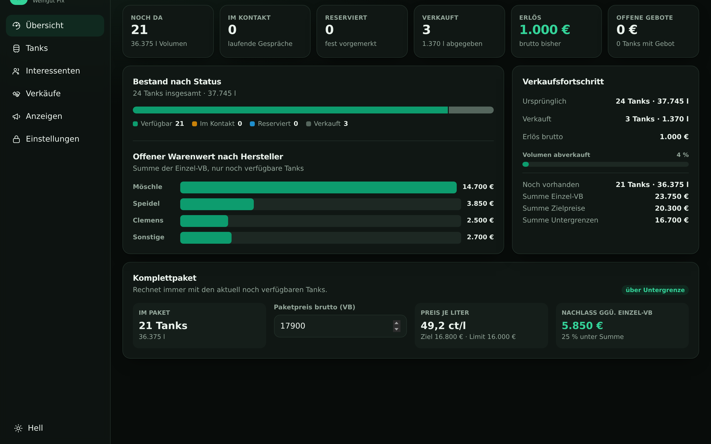

# Tankverkauf · Weingut Pix

Verkaufsdashboard für die Edelstahltanks aus der Betriebsauflösung: Bestand, Interessenten,
Gebote, Verkäufe und Kleinanzeigen-Texte an einer Stelle — auf dem Handy genauso wie am Rechner.



## Wie es aufgebaut ist

| Teil | Umsetzung | Warum |
|---|---|---|
| Frontend | React 19 + TypeScript + Vite + Tailwind v4 | schnell, ein Build-Schritt, keine Laufzeit-Abhängigkeit |
| Hosting | GitHub Pages (dieses öffentliche Repo) | kostenlos, von jedem Gerät erreichbar |
| Datenbank | eine `db.json` in einem **privaten** GitHub-Repo | keine Extra-Dienste, jede Änderung ist ein Commit |
| Login | Fine-grained Token, mit PIN verschlüsselt im Browser | kein Konto, kein Server, Handy-Verlust unkritisch |
| Export | SheetJS, nachgeladen nur beim Klick | Excel-Datei im Format der bisherigen Preisliste |

**Warum kein Supabase?** Für einen einzigen Nutzer und 24 Tanks wäre eine echte Datenbank mehr
Aufwand als Nutzen: zusätzliches Konto, Tabellenschema, RLS-Regeln (falsch gesetzt = Datenleck)
und ein Free-Tier, das nach 7 Tagen Inaktivität pausiert. Die JSON-Datei im privaten Repo kostet
nichts, schläft nie ein und bringt die vollständige Änderungshistorie gratis mit.

### Warum zwei Repositories

Dieses Repo ist **öffentlich** — nötig, damit GitHub Pages ohne bezahlten Tarif funktioniert.
Namen und Telefonnummern von Interessenten dürfen darin nicht liegen. Deshalb:

```
hannespix/tankverkauf         (öffentlich)  → Programmcode, wird zu GitHub Pages deployed
hannespix/tankverkauf-data    (privat)      → db.json mit allen echten Daten
```

Die App warnt sichtbar, falls das eingestellte Daten-Repo doch öffentlich ist.

## Einrichtung (einmalig, ca. 2 Minuten)

1. **Privates Repo anlegen** — [github.com/new](https://github.com/new), Name `tankverkauf-data`,
   Sichtbarkeit **Private**. Eine leere Datei genügt; `db.json` legt die App beim ersten Speichern an.
2. **GitHub Pages aktivieren** — in *diesem* Repo unter *Settings → Pages* bei *Source*
   **GitHub Actions** wählen. Der Workflow in `.github/workflows/deploy.yml` läuft dann bei
   jedem Push auf `main`.
3. **Token erzeugen** — [Fine-grained Token](https://github.com/settings/personal-access-tokens/new):
   - *Repository access*: **Only select repositories** → `tankverkauf-data`
   - *Permissions → Repository permissions*: **Contents: Read and write**
   - Ablaufdatum nach Bedarf (bei Ablauf einfach neu erzeugen und in der App eintragen)
4. **App öffnen** — `https://hannespix.github.io/tankverkauf/`, dem Assistenten folgen:
   Repo eintragen → Token einfügen → PIN wählen.

Auf jedem weiteren Gerät nur Schritt 4 wiederholen. Die PIN kann pro Gerät unterschiedlich sein.

> Ohne Token lässt sich die App über **„Nur ansehen"** im Demo-Modus ausprobieren. Alles ist
> bedienbar, nichts wird gespeichert.

## Was drin ist

**Übersicht** — Kennzahlen, Bestand nach Status, offener Warenwert je Hersteller,
Paketrechner und eine Aufgabenliste (fällige Wiedervorlagen, Gebote unter der Untergrenze,
veraltete Anzeigen, Anzeigen zum Hochholen).

**Tanks** — Suche, Filter nach Status/Hersteller/Volumen/Gebot, sortierbare Spalten,
Bearbeiten direkt in der Zeile. Mehrere Tanks anhaken → **als Paket verkaufen**; der Preis
wird einmal auf das Paket gebucht, nicht pro Tank.

Jeder Tank führt drei Preise aus der Preisliste mit: **VB**, **Zielpreis** und **Untergrenze**.
Ein eingetragenes Gebot wird sofort dagegen eingeordnet — grün über Ziel, orange im
Verhandlungsrahmen, rot unter der Untergrenze. Damit ist am Telefon sofort klar, wie weit du gehen kannst.

**Interessenten** — Kontakt, Quelle, Phase, Budget, Wiedervorlage, Interesse an konkreten Tanks.
Eine Kleinanzeigen-Nachricht lässt sich einfügen; Name, Telefonnummer, E-Mail und der gefragte
Tank werden automatisch erkannt.

**Verkäufe** — gebuchte Verkäufe mit Bezahlt-/Abgeholt-Status, Nachlass gegenüber Einzel-VB
und Preis je Liter. Ein Verkauf lässt sich zurücknehmen; die Tanks sind dann wieder verfügbar.

**Anzeigen** — der Anzeigentext-Generator.

## Öffentliche Liste für Käufer

Unter *Einstellungen → Öffentliche Liste* lässt sich eine reduzierte Fassung des Bestands ins
öffentliche Repository schreiben. Interessenten öffnen sie unter
`https://<user>.github.io/tankverkauf/katalog.html`, kreuzen an was sie brauchen — gleiche
Positionen mit Mengenauswahl statt 29 Häkchen — und schicken daraus eine vorausgefüllte E-Mail.
Kein Server, kein Konto, kein Login.

**Veröffentlicht werden** Kategorie, Hersteller, Bezeichnung, Volumen und die VB, und nur von
Positionen, die noch nicht verkauft sind. **Nicht veröffentlicht werden** Zielpreise,
Untergrenzen, Gebote, Notizen, Interessenten und Fotos. Die Liste wird nach Whitelist gebaut —
es kann also nichts versehentlich mitrutschen, auch wenn das Datenmodell später wächst.

Damit das Schreiben funktioniert, muss der Token auch für das öffentliche Repository
freigegeben sein (im Token unter *Repository access* beide auswählen).

> **Nicht aus einer Kleinanzeige heraus verlinken.** Kleinanzeigen erlaubt externe Links nur als
> weiterführende Information zum dort angebotenen Artikel und untersagt Links auf konkurrierende
> Angebotsseiten. Nach dem Erstkontakt per Mail oder Messenger verschicken ist unproblematisch.

## Der Anzeigen-Generator

Vier Vorlagen: **Komplettpaket**, **Hersteller-Bundle**, **Einzeltank**, **Restposten (Kurzfassung)**.
Der Text entsteht immer aus dem aktuellen Bestand — Titel, Beschreibung und Preis getrennt,
jeweils mit eigenem Kopieren-Knopf und Zeichenzähler gegen die Kleinanzeigen-Grenzen
(Titel 65, Beschreibung 4.000).

Der Clou: Zu jeder veröffentlichten Anzeige wird ein Fingerabdruck des beworbenen Bestands
gespeichert. Verkaufst du einen Tank, meldet sich die betroffene Anzeige von selbst und sagt
konkret, was sich geändert hat:

> **Seit dem letzten Erzeugen geändert:**
> · 2 beworbene Tanks sind inzwischen verkauft (Speidel 525 l, Speidel 625 l)
> · Anzahl im Angebot: 21 → 19

Ein Klick auf *Text neu erzeugen* bringt die Anzeige wieder auf Stand. Dazu kommt eine
Erinnerung zum Hochholen, wenn eine Anzeige länger als eingestellt online ist.

### Kleinanzeigen automatisch befüllen?

Geht nicht — und das ist keine Bequemlichkeit, sondern eine Tatsache:
**Kleinanzeigen bietet privaten Verkäufern keine offizielle Schnittstelle an.** Anzeigen lassen
sich ausschließlich über die Website einstellen. Es gibt kommerzielle Dritt-Dienste, die das per
Automatisierung umgehen; die arbeiten gegen die Nutzungsbedingungen und riskieren die Sperrung
des Kontos. Deshalb ist der Weg hier bewusst manuell, aber so kurz wie möglich:
drei Felder kopieren, im Formular einfügen, fertig. Die URL der fertigen Anzeige kannst du
hinterlegen, dann führt ein Klick direkt zum Bearbeiten.

## Datensicherheit

- Der Token liegt **verschlüsselt** im Browser (PBKDF2 mit 250.000 Runden + AES-GCM, WebCrypto).
  Ohne PIN ist er nicht lesbar — ein verlorenes Handy gibt keinen Zugriff her.
- Der Token wird ausschließlich an `api.github.com` geschickt, an sonst nichts.
- Der Token-Umfang lässt sich nicht ausweiten: Er gilt für ein Repository und nur für Contents.
- Bearbeitest du auf zwei Geräten gleichzeitig, wird der zweite Schreibvorgang **erkannt und
  abgefragt** statt still zu überschreiben (Optimistic Concurrency über den Datei-SHA).
  Der überschriebene Stand bleibt als Commit erhalten.
- Ohne Netz wird lokal weitergearbeitet und beim nächsten Verbinden gespeichert.

## Entwicklung

```bash
npm install
npm run dev        # http://localhost:5173/tankverkauf/
npm run build      # Produktionsbuild nach dist/
npm run typecheck
```

Deployment passiert automatisch bei Push auf `main`.

## Datenherkunft

Der Ausgangsbestand in `src/lib/seed.ts` stammt aus
*Edelstahltanks_Preisliste_Weingut_Pix_aktualisiert.xlsx*:
24 Tanks · 37.745 l · 25.100 € Summe Einzel-VB (brutto inkl. 19 % MwSt.),
davon 2× Speidel 310 l und 1× Speidel 750 l bereits als Paket für 1.000 € verkauft.
Zielpreise und Untergrenzen kommen aus dem Blatt *Preisvariablen*.

Eine aktualisierte Preisliste lässt sich unter *Einstellungen → Preisliste importieren*
einlesen; Interessenten und Verkäufe bleiben dabei erhalten.
